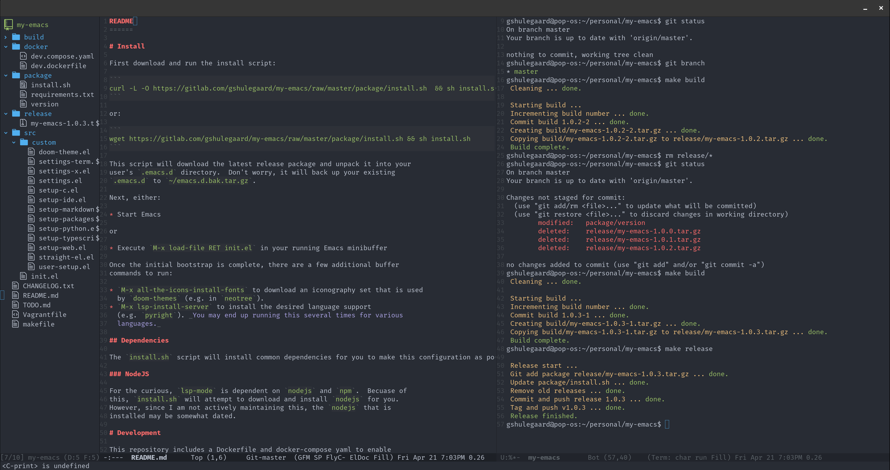
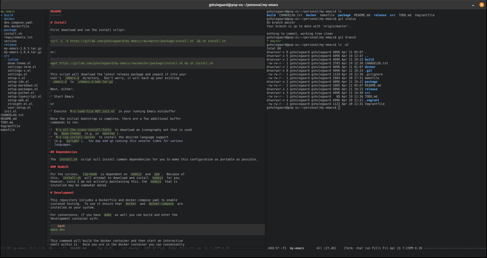

README
======





# Install

First download and run the install script:

```
curl -L -O https://github.com/gshulegaard/emacs-conf/raw/master/package/install.sh && sh install.sh
```

or:

```
wget https://github.com/gshulegaard/emacs-conf/raw/master/package/install.sh && sh install.sh
```

This script will download the latest release package and unpack it into your
user's `.emacs.d` directory.  Don't worry, it will back up your existing
`.emacs.d` to `~/emacs.d.bak.tar.gz`.

Next, either:

* Start Emacs

or

* Execute `M-x load-file RET init.el` in your running Emacs minibuffer

Once the initial bootstrap is complete, there are a few additional buffer
commands to run:

* `M-x all-the-icons-install-fonts` to download an iconography set that is used
  by `doom-themes` (e.g. in `neotree`).
* `M-x lsp-install-server` to install the desired language support
  (e.g. `pyright`). _You may end up running this several times for various
  languages._

## Dependencies

The `install.sh` script will install common dependencies for you to make this configuration as portable as possible.

### NodeJS

For the curious, `lsp-mode` is dependent on `nodejs` and `npm`.  Becuase of
this, `install.sh` will attempt to download and install `nodejs` for you.
However, since I am not actively maintaining this, the `nodejs` that is
installed may be somewhat dated.

# Development

This repository includes a Dockerfile and docker-compose yaml to enable
isolated testing.  To use it ensure that `docker` and `docker-compose` are
installed on your system.

For convenience, if you have `make` as well you can build and enter the
development container with:

``` bash
make dev
```

This command will build the docker container and then start an interactive
shell within it.  Once you are in the docker container you can conveniently
"install" (copy into `~/.emacs.d`) with another `make` command:

``` bash
(container)$ make install
```

After this you can start Emacs within the container and the first time
initialization should trigger.

## GUI testing

When using the `docker` container flow for development, you will be limited to a
TTY terminal.  Obviously Emacs in a terminal is a different experience than a
full desktop experience.

You can also use `make install` locally to copy the current files to your
current user's `~/.emacs.d`.

# Caution

This is my personal Emacs configuration.  It is a perpetual work in progress,
but I do actively use it.  Since I tend to make updates in waves (if it ain't
broke...) there tends to be some amount of cruft and breakage that accumulates
between updates.

The best use of this repository is probably as a reference to create your own
configuration.
